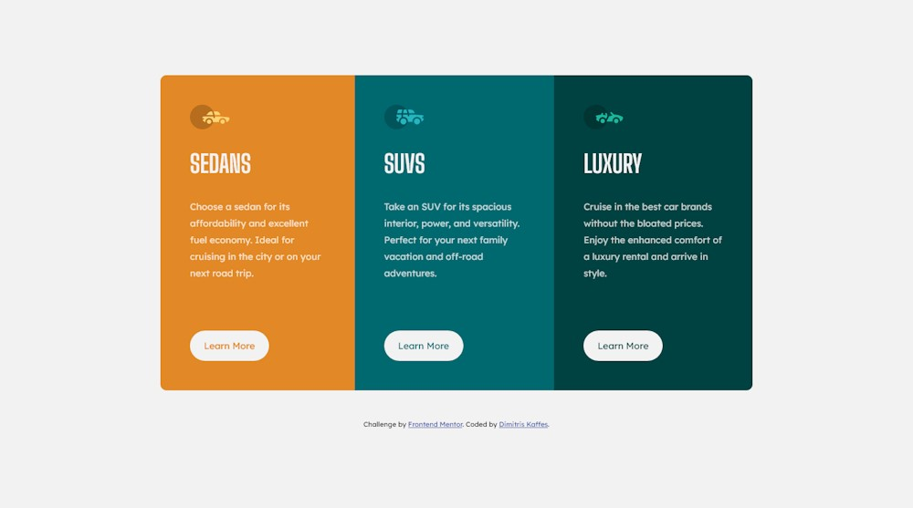

# Frontend Mentor - 3-column preview card component solution

This is a solution from Dimitris Kaffes to the [3-column preview card component challenge on Frontend Mentor](https://www.frontendmentor.io/challenges/3column-preview-card-component-pH92eAR2-).

## Table of contents

- [Overview](#overview)
  - [The challenge](#the-challenge)
  - [Screenshot](#screenshot)
  - [Links](#links)
- [My process](#my-process)
  - [Built with](#built-with)
  - [What I learned](#what-i-learned)
  - [Continued development](#continued-development)
  - [Useful resources](#useful-resources)
- [Author](#author)
- [Acknowledgments](#acknowledgments)

## Overview

Mobile-first design was implemented.

The main concern was to avoid using unnecessary declarations and keep the `css` simple and clean.

A media query was used to add complexity and transform the Normal Flow of the mobile view to a Flexbox layout on the desktop view.

### The challenge

Users should be able to:

- View the optimal layout depending on their device's screen size
- See hover states for interactive elements

### Screenshot

### Links

- Solution URL: [3-column-preview-card-component solution on Github](https://github.com/dkaffes/3-column-preview-card-component)
- Live Site URL: [3-column-preview-card-component live site](https://dkaffes.github.io/3-column-preview-card-component/)

## My process

Proper HTML structure with the use of landmark elements was followed.

For the buttons, `<a>` elements were used since normally they will direct to an info page.

Active state on the buttons was added. A trick using `box-shadow` for creating the border was used to avoid the creation of an external border.

The normal flow transforms to a flex layout using a media query.

### Built with

- Semantic HTML5 markup
- CSS custom properties
- Flexbox
- Mobile-first workflow

### What I learned

Better understanding of the mobile-first workflow.

### Continued development

The use of CSS custom properties (variables) so that the colors can be reused throughout the stylesheet.

### Useful resources

- [Border with box-shadow](https://www.udemy.com/course/design-and-develop-a-killer-website-with-html5-and-css3/) - A project implementation in this course helped me create the border trick for the active state of the button.

## Author

- Frontend Mentor - [@dkaffes](https://www.frontendmentor.io/profile/dkaffes)

## Acknowledgments

Special thanks to [Jonas Schmedtmann](https://codingheroes.io/) for his HTML and CSS course mentioned above.
